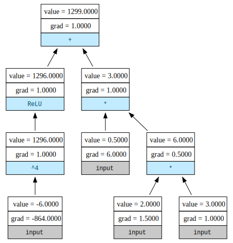

# MinGrad

Mingrad is a minimal autograd engine that implements backpropagation (a.k.a reverse-mode automatic differentiation / autograd) over a dynamically built directed acyclic graph (DAG). It supports scalar values, making it simple and intuitive to understand the core concepts of gradient computation and neural network training.

Inspired by [senpai](https://x.com/karpathy)'s micrograd.

This project is ideal for:
* Learning how autograd engines work under the hood.
* Understanding the basics of neural networks and backpropagation.
* Experimenting with custom neural network architectures.

## Features
* **Scalar Autograd Engine**: Mingrad computes gradients for scalar values, making it easy to visualize and debug.
* **Neural Network Module**: Includes a simple neural network library with support for layers, activation functions, and loss computation.
* **Dynamic Computation Graph**: Builds and evaluates computation graphs on the fly.
* **Minimal Codebase**: The entire implementation is concise and easy to follow, with fewer than 300 lines of code.
* **Educational Focus**: Designed to help you learn the fundamentals of deep learning and autograd systems.

## Usage:

```python
a = Scalar(1.5)
b = Scalar(-4.0)
c = a**3 / 5
d = c + (b**2).relu()

# compute gradients
d.backward()

draw_graph(d)
```



## Repo structure
1. [`demo.ipynb`](Demo.ipynb): A simple implementation of MLP to solve make moons dataset.
2. [`mingrad/scalar.py`](mingrad/scalar.py): The logic for scalar class.
3. [`mingrad/nn.py`](mingrad/nn.py): The implementations of nn.module, neuron and MLP classes.
4. [`mingrad/visualize.py`](mingrad/visualize.py): This draws nice-looking computational graphs. Install [Graphviz](https://graphviz.readthedocs.io/en/stable/manual.html) to run it.
