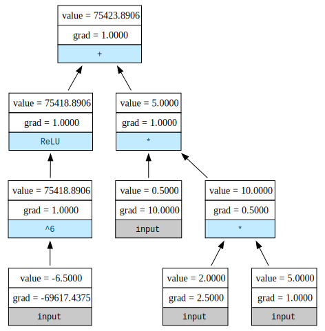

# MinGrad

Mingrad is a minimal autograd engine that implements backpropagation (a.k.a reverse-mode automatic differentiation / autograd) over a dynamically built directed acyclic graph (DAG). It supports scalar values, making it simple and intuitive to understand the core concepts of gradient computation and neural network training.

Inspired by [senpai](https://x.com/karpathy)'s micrograd.

This project is ideal for:
* Learning how autograd engines work under the hood.
* Understanding the basics of neural networks and backpropagation.
* Experimenting with custom neural network architectures.

## Features
* **Scalar Autograd Engine**: Mingrad computes gradients for scalar values, making it easy to visualize and debug.
* **Neural Network Module**: Includes a simple neural network library with support for layers, activation functions, and loss computation.
* **Dynamic Computation Graph**: Builds and evaluates computation graphs on the fly.
* **Minimal Codebase**: The entire implementation is concise and easy to follow, with fewer than 300 lines of code.
* **Educational Focus**: Designed to help you learn the fundamentals of deep learning and autograd systems.

## Setup
This project uses [uv](https://docs.astral.sh/uv/) for package/project management. 
To run this project, follow the below setup instructions.

1. Install uv if you haven't already. [Here's](https://docs.astral.sh/uv/getting-started/installation/) the installation instructions.
2. Clone the repo.
   ```sh
   git clone https://github.com/PraveenKishore/mingrad.git
   cd mingrad
   ```
3. Create virtual env and install dependencies.
   ```sh
   uv sync
   ```
4. Activate the virtual env.
   ```sh
   source .venv/bin/activate  # Activate the virtual environment (Linux/MacOS)
   # OR
   .\.venv\Scripts\activate  # Activate the virtual environment (Windows)
   ```
5. You're all set!

## Usage:
```python
a = Scalar(2)
b = Scalar(-6.5)
c = a*5 / 2
d = c + (b**6).relu()

# compute gradients
d.backward()

draw_graph(d)
```



## Repo structure
1. [`demo.ipynb`](Demo.ipynb): A simple implementation of MLP to solve make moons dataset.
2. [`mingrad/scalar.py`](mingrad/scalar.py): The logic for scalar class.
3. [`mingrad/nn.py`](mingrad/nn.py): The implementations of nn.module, neuron and MLP classes.
4. [`mingrad/visualize.py`](mingrad/visualize.py): This draws nice-looking computational graphs. Install [Graphviz](https://graphviz.readthedocs.io/en/stable/manual.html) to run it.
